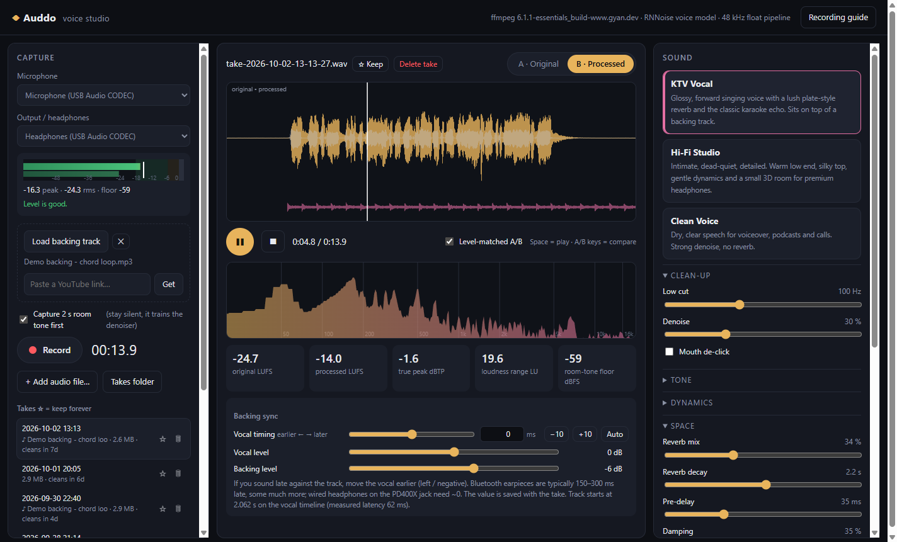
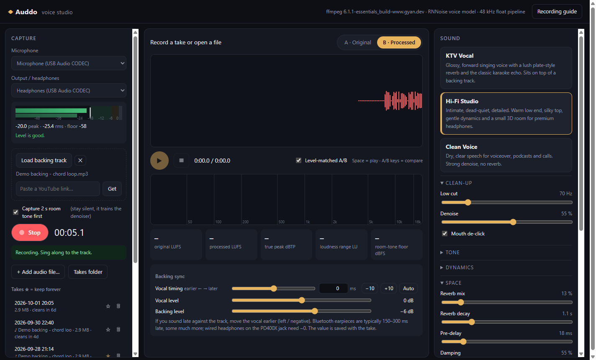
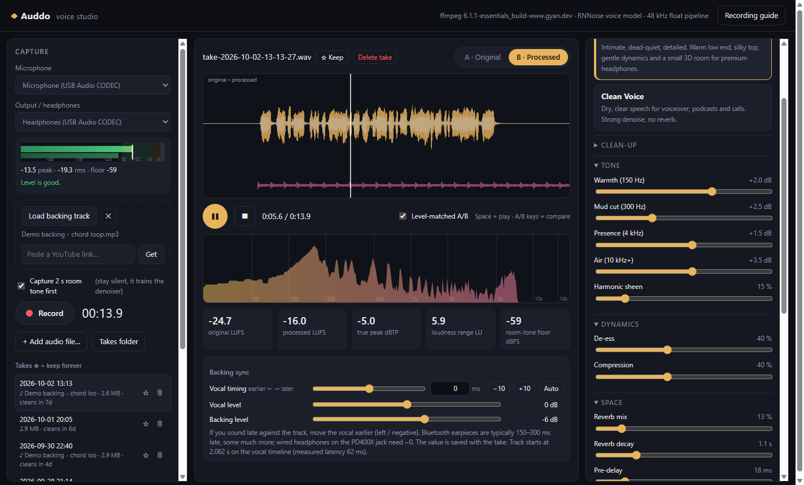
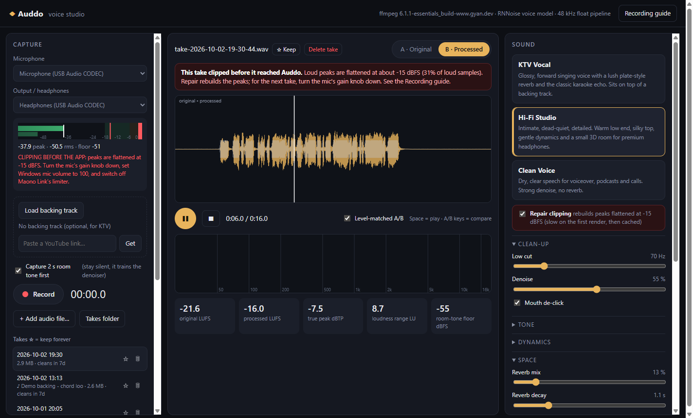
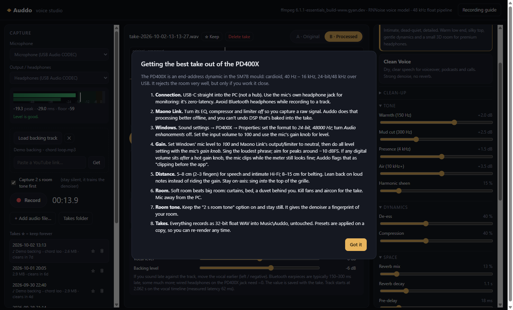

# Auddo

**A desktop voice studio for home singers and speakers.** Record against a backing track, then turn a raw USB-mic take into a polished vocal with one click. There are two signature presets: **KTV Vocal**, a glossy karaoke voice with lush reverb and echo, and **Hi-Fi Studio**, an intimate, dead-quiet, detailed vocal for premium headphones.

Built with Electron and FFmpeg for Windows. Tuned for end-address dynamic mics like the Maono PD400X / Shure SM7B family, but it works with any input.



---

## Features

### 🎙️ Recording that keeps the raw signal
- Captures the mic **bit-exact as 32-bit float WAV**, with every browser "voice" feature (echo cancellation, noise suppression, auto-gain) turned off.
- Takes stream straight to disk (`Music\Auddo`), so a crash doesn't lose the recording.
- A **level meter** with a target zone, peak hold and a running room-noise floor readout.
- An optional **2 s room-tone capture** at the start: stay silent and the denoiser learns your room's fingerprint.



### 🎤 Sing against a backing track
- Load any audio file as the backing track, or **paste a YouTube link**. Auddo downloads the best audio stream and saves an MP3 into `Music\Auddo\Backing`, ready to sing over. yt-dlp is fetched automatically on first use and self-updates when YouTube changes; nothing else to install.
- The track plays on the **same sample clock** as the recording, so its start position on the vocal timeline is known exactly. The measured device latency is compensated automatically.
- **Vocal timing control** for laggy earpieces (Bluetooth can be 150–300 ms or more): drag, nudge in ±10 ms / ±1 ms steps, or type any offset. The value is saved with each take.
- Separate vocal and backing levels; the export can include the mix.

### ✨ One-click presets, every knob exposed
| Preset | Sound | Loudness |
|---|---|---|
| **KTV Vocal** | Forward and glossy, plate-style stereo reverb and ping-pong echo, sits on top of a track | −14 LUFS |
| **Hi-Fi Studio** | Intimate and quiet: warm low end, silky top, gentle dynamics, a small 3D room | −16 LUFS |
| **Clean Voice** | Dry, clear speech for voiceover and podcasts | −16 LUFS |

Every stage can be adjusted (low cut, denoise, de-click, warmth, mud, presence, air, harmonic sheen, de-ess, compression, reverb mix/decay/pre-delay/damping/width, echo, loudness target). Changes **re-render automatically**.



### 🎧 Honest A/B comparison
- Press **A / B** (or the toggle) to switch between the original and the processed take mid-playback.
- **Level-matched by default**, so "louder" can't masquerade as "better".
- Waveform overlay, live spectrum, and EBU R128 stats: integrated LUFS, true peak and loudness range.

### 🩺 Catches clipping your meter can't see
A common USB-mic trap: the gain knob is too hot, so the signal clips inside the mic, then a digital volume (the Windows input slider, the mic's companion app) turns it down. The meter reads −10 dBFS and looks perfect, but every loud peak is squared off.

Auddo detects this two ways:
- **live, on the meter**, while you set levels;
- **per take**, when you open a recording.

It can then **repair the take**, rebuilding the flattened peaks (cached, so tweaking presets afterwards stays fast).



### 🗂️ Takes library and auto-clean
- Recent takes with backing-track tags. ☆ star a take to keep it forever; 🗑 delete it (two clicks, goes to the Recycle Bin).
- **+ Add audio file** imports any recording into the library.
- **Auto-clean** after 3 / 7 / 14 / 30 days (default 7) removes unstarred takes and downloaded tracks you haven't used. Everything goes to the Recycle Bin. Starred takes, the tracks they use, the open take, and your exports are never touched. The temporary render cache clears daily.

### 💾 Export
WAV 24-bit / 48 kHz master, FLAC 24-bit, WAV 16-bit (dithered), or MP3 320. Vocal only, or mixed with the backing track at your offset and balance, normalised and limited to −1 dBTP.

### 📖 Built-in recording guide
Mic technique, gain staging, Windows settings and room tips, one click away.



---

## Signal chain

Everything runs at **48 kHz / 32-bit float** through FFmpeg:

```
input → 4th-order high-pass → mouth de-click → [clip repair] → RNNoise (voice model)
      → spectral denoise keyed to the take's room tone → soft expander
      → warmth / mud EQ → 2-stage compressor → presence / air EQ → harmonic exciter → de-esser
      → stereo convolution reverb + ping-pong echo (synthetic impulse response)
      → EBU R128 loudness → 4× oversampled limiter at −1 dBTP
```

The reverb and echo are built as an impulse response generated in code: decorrelated left/right tails that darken as they decay, plus early reflections. That gives width on headphones without phasey tricks. The chain adds **zero latency**, so exports stay sample-aligned with the backing track.

## Getting started

Requires Node.js 20+ on Windows.

```bash
git clone https://github.com/tyhh00/Auddo.git
cd Auddo
npm install
npm start
```

### Best results with a USB dynamic mic
1. Plug straight into the PC and monitor through the **mic's headphone jack** (zero latency).
2. Turn **off** the mic app's EQ, compressor and limiter, and set **Windows mic volume to 100**. Set your level with the **gain knob only**.
3. In Windows Sound settings, set the mic format to **24-bit, 48000 Hz** and switch off **Audio enhancements**.
4. Peaks around **−10 dBFS** on your loudest line, singing 5–15 cm from the grille.

## Tests

```bash
npm test           # DSP: loudness accuracy, true-peak ceiling, noise reduction, zero added latency
npm run test:e2e   # drives the real app with a fake mic: record → render → A/B → export
npm run test:lib   # clipping detection + repair, takes library, auto-clean, sync range
npm run test:yt    # paste a YouTube link (needs network)
node scripts/screenshots.js   # regenerate the screenshots above from a synthetic demo
```

The end-to-end tests use Playwright's Electron driver with Chromium's fake capture device, so they exercise the real recording path.

## Built on
- [FFmpeg](https://ffmpeg.org) via [ffmpeg-static](https://github.com/eugeneware/ffmpeg-static): filters, loudness, encoding
- [RNNoise](https://github.com/xiph/rnnoise) models from [GregorR/rnnoise-models](https://github.com/GregorR/rnnoise-models)
- [yt-dlp](https://github.com/yt-dlp/yt-dlp): backing-track downloads
- [Electron](https://www.electronjs.org)

Only download tracks you have the right to use.

## License

MIT
